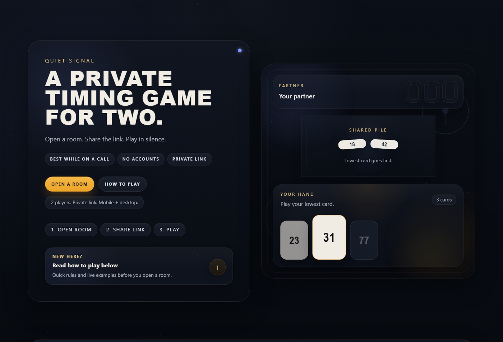
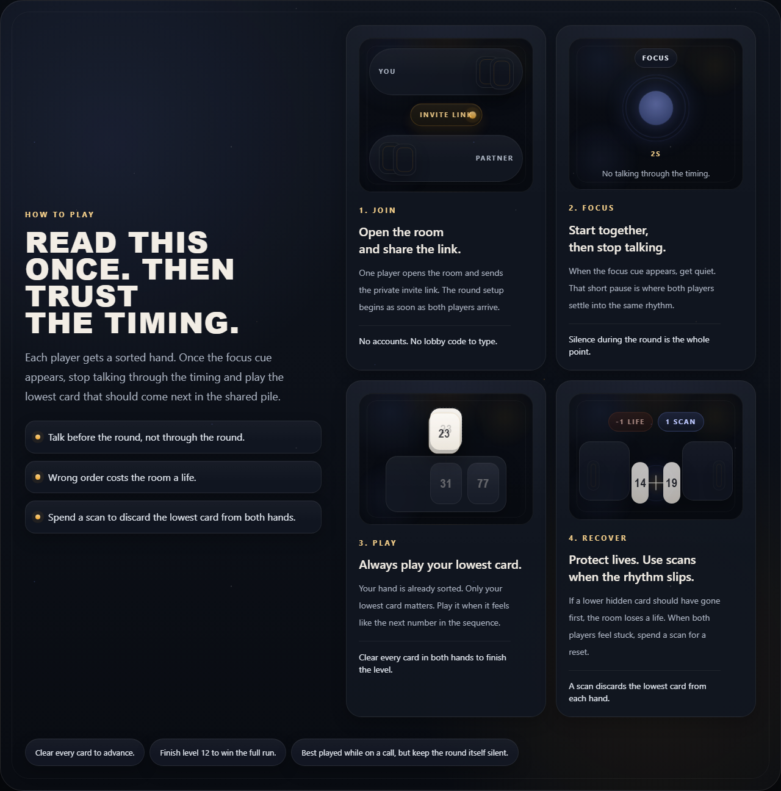
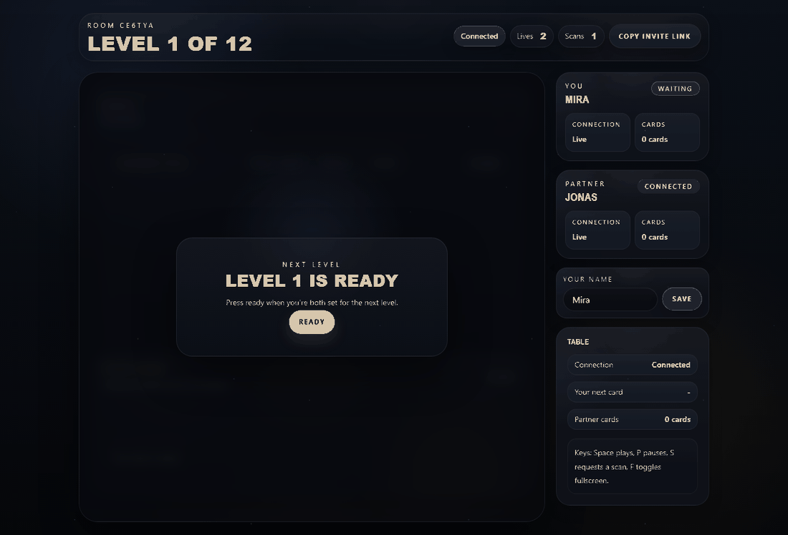
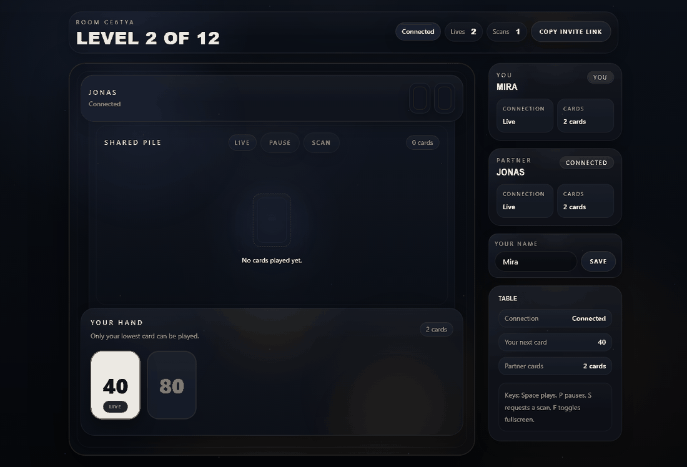
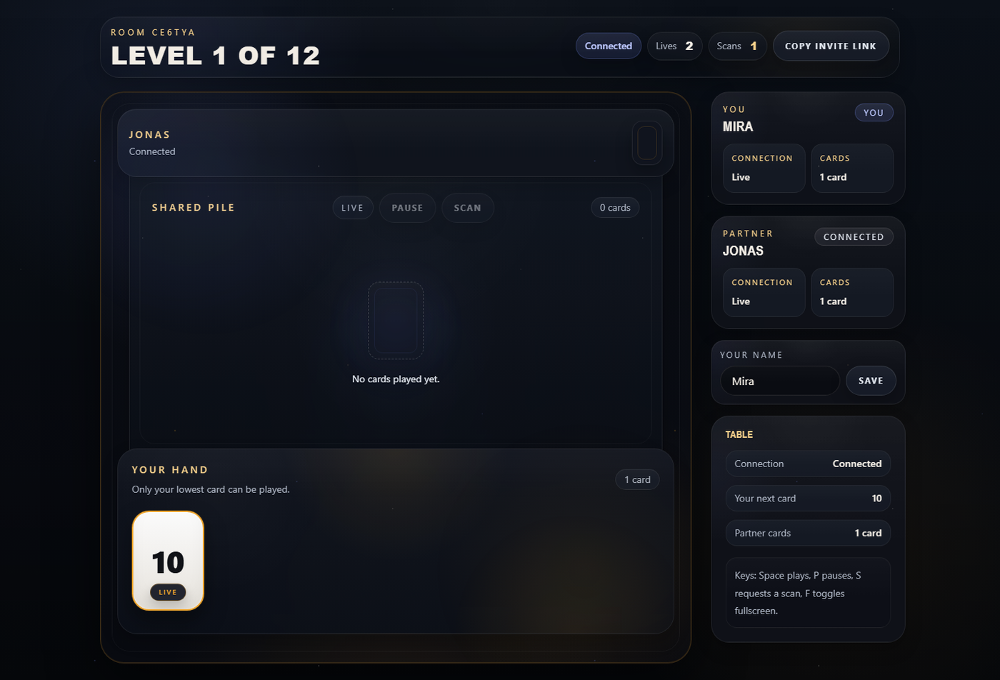
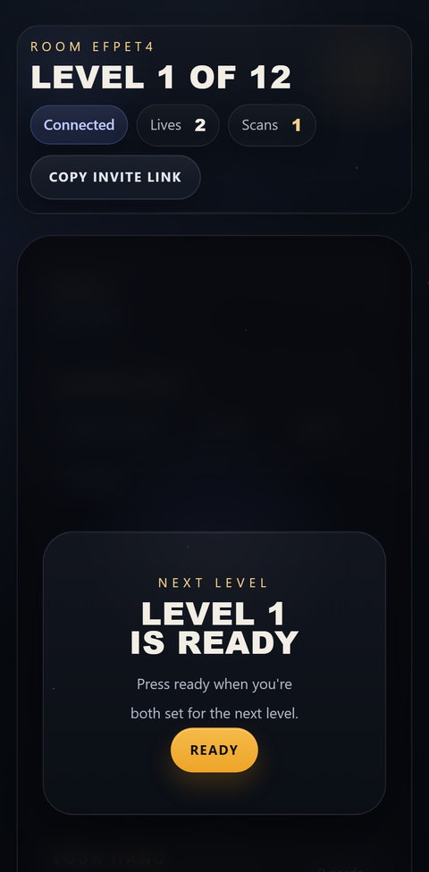

# Quiet Signal

A private real-time timing game for two people.

Open a room. Share one link. Get quiet. Try to empty both hands in ascending order without talking through the round.



## What this project is

Quiet Signal exists for one specific job: let two people play a tense cooperative timing game from anywhere with almost no setup.

The whole point is low friction:

- one private room
- one invite link
- no accounts
- no lobby codes
- mobile and desktop support
- built for long-distance play while already on a call

## How to play



1. One player opens a room and sends the private invite link.
2. When both players arrive, press `Ready`.
3. When the focus cue appears, stop talking.
4. Each player has a sorted hand, but can only see their own cards.
5. Play the lowest card from either hand into the shared pile in ascending order.
6. If a higher card lands before a lower hidden card, the room loses a life.
7. If the room gets stuck, use a `Scan` to discard the lowest card from both hands.
8. Clear the full level to advance.
9. Finish level 12 to complete the run.

## The Flow

### A clean round



This is the core loop: ready up, lock in during the focus cue, play in silence, and clear the level together.

### What a mistake costs



If someone jumps the order, the room loses a life immediately. The game is simple, but the pressure is real.

## Screens

### Live room



### Mobile



## Controls

| Input | Action |
| --- | --- |
| `Space` | Play your lowest card |
| `P` | Request a pause |
| `S` | Request a scan |
| `F` | Toggle fullscreen |

## Stack

- React 19
- Vite 7
- Hono
- Cloudflare Workers
- Durable Objects
- Zod
- Zustand
- Playwright

## Run locally

Install dependencies:

```bash
npm install
```

Run the full multiplayer stack locally:

```bash
npm run dev:edge
```

Then open:

```text
http://127.0.0.1:4173/
```

`npm run dev` still exists for a fast frontend loop, but `npm run dev:edge` is the correct command for real room testing because it runs the Worker and Durable Object stack.

## Test

```bash
npm run lint
npm run typecheck
npm run test:unit
npm run test:worker
npm run test:e2e
```

## Deploy

This project is set up for Cloudflare Workers.

```bash
npm run build
npm run deploy
```

After deployment, your live URL will look like:

```text
https://quiet-signal-online.<your-subdomain>.workers.dev
```
